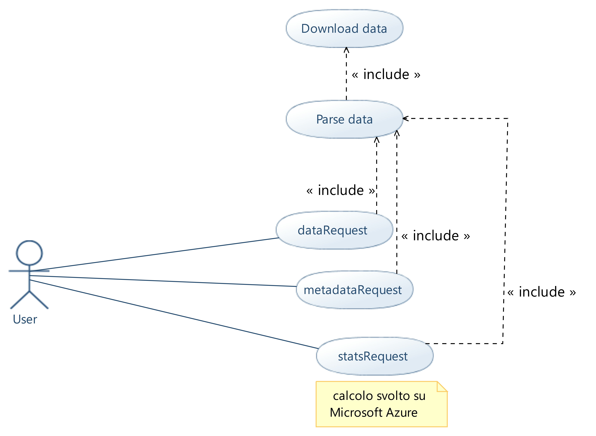
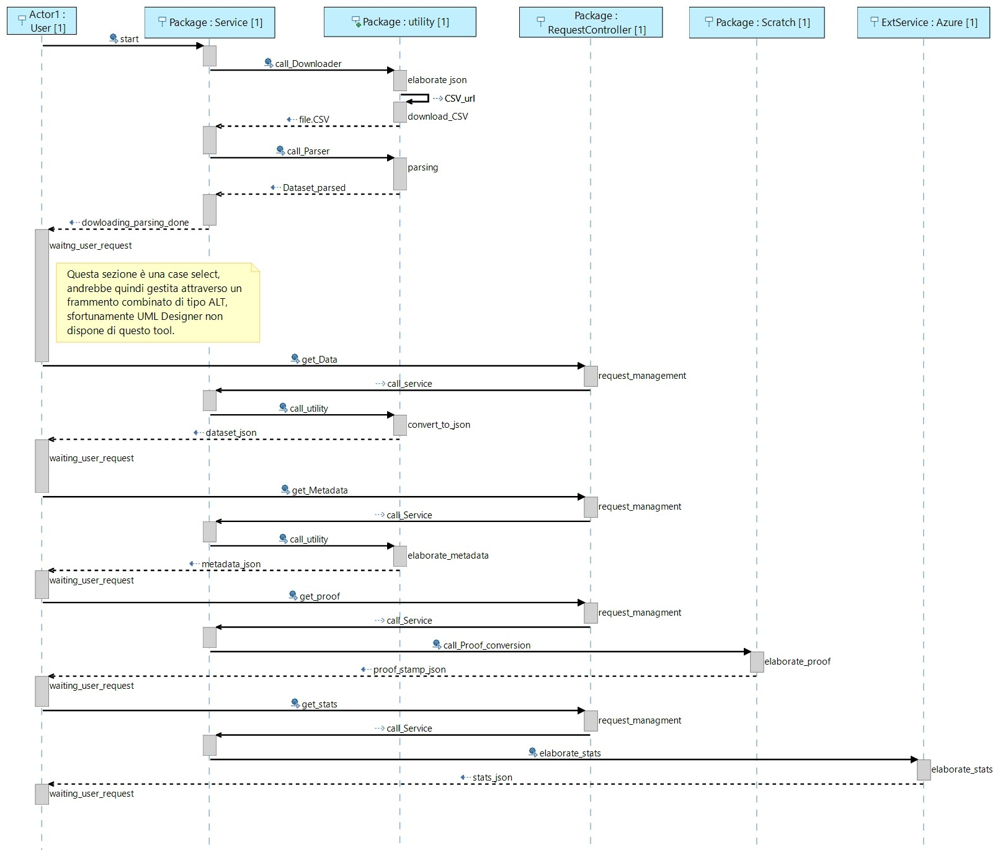

# prog-OOP-and-CER

Il presente progetto é relativo al corso di "Programmazione ad oggetti", con una sezione aggiuntiva di implementazione riguardante il corso di "Calcolatori elettronici e reti di calcolatori".

L’applicazione sviluppata si propone di realizzare un’interfaccia web per la gestione di richieste da parte di client.
In particolare, le richieste sono inoltrate sotto forma di REST API e permettono all’utente di ottenere dati, metadati e statistiche riguardanti un dataset di riferimento.



Dopo la fase di inizializzazione del web server il flusso di esecuzione prevede l’acquisizione dei dati forniti da un server esterno, tramite richiesta http.
In seguito tali dati vengono analizzati e strutturati in modo da poter essere gestiti.
Terminata questa prima fase l’applicativo si mette in ascolto di eventuali richeste da parte del client.

L’interfaccia permette di soddisfare le seguenti richieste:

- restitiure il dataset o un suo sottoinsieme;
- restituire i metadati rellativi al dataset;
- restituire le statistiche del dataset o di un suo sottoinsieme;
- restituire una pagina html di help;
- restituire pagina informativa relativa alla codifica dei tipi nativi in Java.

La restituzione dei dati avviene in formato json.

L’applicazione si suddivide in due parti, la prima é stata sviluppata in **Java** e si occupa delle delle funzioni di interfaccia, del download e del parsing dei dati; la seconda é stata sviluppata in linguaggio **Pyhton** e si propone di eseguire il calcolo delle statistiche serverless sulla piattaforma cloud **Microsoft Azure**.

Una possibile scenario di utilizzo é la creazione di un web server per la gestione di richieste da molteplici client, scaricando il calcolo computazionalmente oneroso su risorse di calcolo esterne.

# Realizzazione


## Routine di inizializzazione

Per lo sviluppo dell'applicazione Java si è scelto l'IDE Eclipse, mentre come application framework è stato utilizzato Spring.
Questa scelta ha permesso di avviare una Spring application, ospitata in un server locale di tipo Apache Tomcat, indirizzabile attraverso la porta locale della macchina.

> localhost:8080

### immagine terminale subito dopo l'avvio

La routine di inizializzazione dell'applicazione prevede il dowloading di un file, attraverso una http request, eseguita sulla base di un URL di riferimento.
Il file scaricato, in formato json, viene poi analizzato e parsato sfruttando i metodi presenti nella classe Downloader con lo scopo di isolare una particolare stringa url, utilizzata per effettuare una seconda operazione di downloading tramite http request.
Questa operazione permette di ottenere un secondo file (formato CSV) contenente il dataset di riferimento.

I dati contenuti in tale file sono separati da segni di punteggiatura "**,**" e "**;**" e  vengono parsati attraverso i metodi presenti nella classe Parser in modo da ottenere dati utilizzabili per il popolamento della classe **Dataset**.

Tale classe è costituita dall'aggregazione delle classi **Data** e **Header**; questa scelta ha permesso di separare, già in fase di popolamento delle classi, i dati relativi alla intestazione, dalle singole istanze del dataset.
Al termine della fase di parsing è stato inoltre previsto un messaggio di conferma per l'utente "**READY**" che in tale modo può verificare la corretta esecuzione della routine di inizializzazione.

## Gestione delle richieste
La gestione delle richieste del client tramite REST API è effettuata dalla classe RequestController che definisce le diverse rotte relative e invoca i metodi corrispondenti ai servizi richiesti dall'utente.
Tali metodi sono contenuti all'interno dell'interfaccia RequestService e sono concretamente implementati nella classe ServiceImplementation.
Sono state previste sia chiamate di tipo GET, sia di tipo POST, in particolare rispondono ad una GET:

1. la chiamata definita dal percorso "**/data**" che restituisce al client i dati relativi al dataset di riferimento in formato json;

2. la chiamata definita dal percorso "**/metadata**" che restituisce al client i metadati relativi al dataset di riferimento in formato json;
Per quest'ultimo caso la scelta architetturale di costituire la classe Dataset come aggregato di Header e Data si è rivelata utile poichè ha permesso di ottenere dinamicamente nome, tipo e valore degli attributi relativi alla classe Header sfruttando la libreria java.lang.reflect all'interno della classe Metadata.

3. la chiamata definita dal percorso "**/**" che restituisce una pagina di help in formato HTML.
4. la chiamata definita dal percorso "**/proof**" che restituisce una pagina di prova contente la stampa di arrays relativi a tutti i tipi nativi di Java, presenti nella classe Ref-Class.
    Questa scelta si è resa necessaria per giustificare l'eliminazione del segno di punteggiatura ";" - introdotto da Java per descrivere gli arrays - al momento della restituzione dei dati all'utente in formato json.

5. la chiamata definita dal percorso "**/stats**" che restituisce all'utente le statistiche, calcolate su tutte le istanze presenti nel dataset di riferimento, in formato json.

Rispondono a chiamata di tipo POST:

1. la chiamata definita dal percorso "/data" che restituisce un sottoinsieme delle istanze del dataset di riferimento, in formato json, qualora l'utente decida di applicare filtri.
In questo caso i filtri relativi al tipo di selezione desiderata dovranno essere inseriti, in formato json, all'interno del body della richiesta.
2. la chiamata definita dal percorso "/stats" che resituisce in formato json le statistiche, calcolate su un sottoinsieme delle istanze del dataset di riferimento, qualora l'utente decida di applicare filtri.
In questo caso i filtri relativi al tipo di selezione desiderata dovranno essere inseriti, in formato json, all'interno del body della richiesta.



## Calcolo statistiche
Il calcolo delle statistiche, gestito all'interno da un modulo esterno caricato sulla piattoforma Microsoft Azure [^1] prevede:

[1^]: vedi #Azure

- il calcolo del numero di istanze della classe Data presenti in un sottoinsieme del dataset di riferimento (eventualmente dell'intero dataset);
- il calcolo della media aritmetica di tutti o di determinati valori, selzionati tramite appositi filtri, dell'attributo "timePeriod" della classe Data.
- il calcolo della deviazione standard sui valori di cui si è precedentemente calcolata la media aritmetica.
- il calcolo del massimo e del minimo sempre sui medesimi valori.

In caso di utilizzo di filtri in cui la risposta é solo una istanza del dataset, le statistiche verranno calcolate su tutti gli anni disponibili di quella singola istanza [^2].

[^2]: si guardi gli esempi riportati in seguito.

## Gestione dei filtri
La classe Filter, all'interno del package Utility, gestisce i filtri applicabili alle richieste provenienti dal client http.

La decisione di permettere l'inserimento dei filtri esclusivamente all'interno del body della richiesta POST come stringa json, evitando l'inserimento di parametri singoli, è motivata dalla necessità di garantire quanta più flessibilità possibile in fase di inserimento.
Infatti, l'inserimento di filtri complessi mediante una serie di parametri singoli, oltre ad essere una pratica tediosa per l'utente, diventava difficilmente gestibile senza compromettere la scalabilità del codice.
Al contrario, la gestione di filtri complessi attraverso un opportuno parsing della stringa json in ingresso, è risultata una soluzione più semplice e facimente scalabile.

Relativamente al valore degli attributi geo e obj della classe Data - i soli che subissero una variazione all'interno del dataset di riferimento - sono stati previsti filtri di tipo logici:
1. ("**AND**") esegue l'AND logico tra i valori specificati; questa operazione restituirá tutte le occorrenze che contengono contemporaneamente parametri di entrambi i campi.
2. ("**IN/OR**") esegue il controllo della presenza di un dato valore nel caso di un singolo parametro in ingresso oppure esegue l'OR logico in caso di parametri multipli in ingresso.
3. ("**NIN/NOT**") esegue il controllo dell'assenza di un dato valore nel caso di un singolo parametro in ingresso oppure esegue il NOR logico in caso di parameri multipli in ingresso

Inoltre i filtri sono relativi alla particolare struttura del dataset di riferimento con la possibilità di scegliere:
1. ("**star**t")/("**end**") specificando anno di inizio/fine del periodo su cui calcolare la statistica.
2. ("**OBJ**") specificando l'obbiettivo o gli obiettivi di riferimento;
3. ("**GEO**") specificando l'area geografica o le aree geografiche di riferimento

Si é adottata questa scelta data la peculiare struttura del dataset a disposizione, poiché alcuni campi presenti assumono lo stesso valore per ogni istanza.

Inoltre, nel caso in cui l'adozione di un determinato filtro comportasse il reperimento di una istanza singola della classe Data, è stata prevista la possibilità di svolgere il calcolo delle statistiche sui valori dell'attributo timePeriod relativi a quell'istanza.

## Metodo trasformatore (comunicazione Java-Azure)
La comunicazione Java-Azure è gestita dalla classe Azure inserita nel pacchetto Utility.

Questa classe agisce da trasformatore prendendo in carico le richieste http definite dalla rotta "/stats", inizialmente inoltrate verso il server locale, trasformandole in richieste di tipo POST verso il server della piattaforma Microsoft Azure, indirizzate sfruttando l'URL fornito dal medesimo servizio.

Come giá accennato, é possibile interagire in due modi per le richieste delle stats.
La prima prevede l’utilizzo della GET per ricevere le statistiche di tutto il dataset.
La seconda, il client esegue una POST al server locale Tomcat specificando come body il filtro, il quale verrá inoltrato ad Azure come parametro della query.

In entrambi i casi il body della chiamata POST, indirizzata ad Azure,  è costituito dalle istanze della classe Data sulle quali è stato richiesto il calcolo delle statistiche.

La scelta di effettuare precedentemente la selezione dei dati tramite filtri permette di inviare verso il servizio di calcolo esclusivamente i dati da elaborare.
Questa soluzione da un lato ha permesso di limitare al minimo le dimensione del corpo delle chiamate, inoltre ha ridotto il tempo di esecuzione del sistema di calcolo remoto (a pagamento) sgravandolo dal compito di filtrare le istanze del dataset.

## Azure
Il progetto é stato pensato con l’obbiettivo di avere una macchina in grado di gestire le richieste da eventuali client e di poter eseguire ingenti quantitá di calcoli senza avere influenza sulla macchina stessa con cui si interfacciano i client.

Un vantaggio di questo designe é la scalabiliá, flessibilitá  e la modularitá.
Infatti non si é piú legati alla macchia a che si ha a disposizione, con la possibilitá di incorrere in rallentamenti nel soddisfare le richieste.

Il calcolo delle statistiche, che é di gran lunga il compito pió oneroso, é scaricato su piattaforme cloud che offrono maggiore capacitá di calcolo senza dover intercorrere nei proibitivi costi di infrastrutture e attrezzature.

## Cache
Si é scelto di implementare una cache per la gestione delle richieste delle statistiche.

La risposta, proveniente da Azure, inoltrata ad un client viene salvata su memoria di massa e resa disponibile ad un qualunque altro client che richiede la stassa richiesta.

Questo approccio é stato scelto per minimizzare il volume delle richieste al servizio Azure, cosicché da minimizzare i costi e il tempo di risposta.


# Utilizzo

Come giá detto, tutti i servizi vengono chiamati tramite una GET, ma alcuni , come "/stats" e "/data", hanno la possibilitá di implementare dei filtri.

Il filtro é specificato come body della POST secondi la sintassi;

> { "$": [ {"GEO": ["", "", ... , "" }, { "OBJ": ["", "", ... , ""] } ], "$start": "", "$end": "" }

Il campo "**$**" corrisponde al tipo di operazione ("$in", "$not", "$and") [^3] .

I campi "**$start**" e "**$end**" [^1] corrispondono all’ anno di inizio e di fine dei parametri che si richiedono; la risposta sará compresa tra questi due valori. É possibile specificare sono uno dei due parametri e il responso sará calcolato in base all’estremo del valore mancante.

Il campo "**GEO**" accetta una lista di stringe di due caratteri che corrispondono ad acronimi dei paesi presenti nel dataset.

Il campo "**OBJ**" , invece, ammette una lista di le stringe corrispondenti ai valori presenti sul dataset.

Questi due ultimi campi non hanno restrizioni sul numero di parametri della lista; é peró possibile che alcune richieste possano dare un insieme vuoto.

Si riporta in seguito un esempio di filtro

> { "$and": [ {"GEO": ["UK", "LV"] }, { "OBJ": ["TOTAL", "OBJ86"] } ], "$start": "2003", "$end": "2014" }

a cui corrisponde il risultato

```json
[
    {
        "freq": "A",
        "geo": "UK",
        "unit": "MEUR_KP_PRE",
        "objective": "TOTAL",
        "timePeriod": [
            1611.586,
            1434.428,
            1397.554,
            1434.041,
            1509.336,
            841.307,
            919.554,
            777.329,
            552.687,
            464.905,
            469.834,
            328.289,
            362.13,
            355.675,
            360.624,
            325.696,
            252.393
        ]
    },
    {
        "freq": "A",
        "geo": "LV",
        "unit": "MEUR_KP_PRE",
        "objective": "TOTAL",
        "timePeriod": [
            0.0,
            0.0,
            0.0,
            0.0,
            46.264,
            95.141,
            154.455,
            72.112,
            10.41,
            37.799,
            34.527,
            52.107,
            46.003,
            45.095,
            46.021,
            16.418,
            19.986
        ]
    },
    {
        "freq": "A",
        "geo": "UK",
        "unit": "MEUR_KP_PRE",
        "objective": "OBJ86",
        "timePeriod": [
            0.0,
            0.0,
            0.0,
            0.0,
            0.0,
            0.0,
            0.0,
            0.0,
            1.903,
            1.042,
            1.736,
            2.126,
            2.086,
            1.146,
            0.538,
            0.0,
            0.0
        ]
    }
]
```

[^3]: il simbolo "*$*" deve essere specificato.

In caso di richiesta di statistiche, la sintassi del filtro é la medesima: allo stesso esempio corrisponde la statistica:

```json
[
    {
        "$and": [
            {
                "GEO": [
                    "UK",
                    "LV"
                ]
            },
            {
                "OBJ": [
                    "TOTAL",
                    "OBJ86"
                ]
            }
        ],
        "$start": "2003",
        "$end": "2014"
    },
    {
        "counter": 3
    },
    {
        "year": 2003,
        "max": 1434.041,
        "min": 0.0,
        "average": 478.01366666666667,
        "stdDev": 676.01341039969179
    },
    {
        "year": 2004,
        "max": 1509.336,
        "min": 0.0,
        "average": 518.5333333333333,
        "stdDev": 700.85782325629748
    },
    {
        "year": 2005,
        "max": 841.307,
        "min": 0.0,
        "average": 312.14933333333335,
        "stdDev": 376.18154271072666
    },
    {
        "year": 2006,
        "max": 919.554,
        "min": 0.0,
        "average": 358.003,
        "stdDev": 402.05201235412312
    },
    {
        "year": 2007,
        "max": 777.329,
        "min": 0.0,
        "average": 283.147,
        "stdDev": 350.67736546955331
    },
    {
        "year": 2008,
        "max": 552.687,
        "min": 1.903,
        "average": 188.33333333333334,
        "stdDev": 257.66035534185096
    },
    {
        "year": 2009,
        "max": 464.905,
        "min": 1.042,
        "average": 167.91533333333331,
        "stdDev": 210.53885760485059
    },
    {
        "year": 2010,
        "max": 469.834,
        "min": 1.736,
        "average": 168.69899999999998,
        "stdDev": 213.35499148758311
    },
    {
        "year": 2011,
        "max": 328.289,
        "min": 2.126,
        "average": 127.50733333333331,
        "stdDev": 143.43287243476959
    },
    {
        "year": 2012,
        "max": 362.13,
        "min": 2.086,
        "average": 136.73966666666666,
        "stdDev": 160.38033439781685
    },
    {
        "year": 2013,
        "max": 355.675,
        "min": 1.146,
        "average": 133.972,
        "stdDev": 157.79109355304774
    },
    {
        "year": 2014,
        "max": 360.624,
        "min": 0.538,
        "average": 135.72766666666669,
        "stdDev": 160.10610311568041
    }
]
```

Si riporta un altro esempio riguardo il calcolo delle statistiche su tutti gli anni di una sola istanza. Si é utilizzato il filtro

> { "$and": [ {"GEO": ["UK"] }, { "OBJ": ["TOTAL"] } ], "$end": "2010" }

che ha prodotto l’output

```json
[
    {
        "$and": [
            {
                "GEO": [
                    "UK"
                ]
            },
            {
                "OBJ": [
                    "TOTAL"
                ]
            }
        ],
        "$end": "2010"
    },
    {
        "freq": "A",
        "geo": "UK",
        "unit": "MEUR_KP_PRE",
        "objective": "TOTAL",
        "timePeriod": [
            1611.586,
            1434.428,
            1397.554,
            1434.041,
            1509.336,
            841.307,
            919.554,
            777.329,
            552.687,
            464.905,
            469.834
        ]
    },
    {
        "counter": 1,
        "max": 1611.586,
        "min": 464.905,
        "average": 11412.561000000002,
        "stdDev": 34439.242402127813
    }
]
```

Non é stato inserito nessun vincolo del filtro per cui ogni elemento puó essere utilizzato come una unitá a se stante. Peró fare attenzione a non mettere piú tipi di operazioni nello stesso filtro; é stato scelto di non imporre vincoli anche se é un’azione deprecata, infatti, con molta probabilitá, restituirá un insieme vuoto o valori discordanti.

Mostriamo un esempio solo con alcuni parametri:

> { "$in": [ {"GEO": ["UK"] } ], "$end": "2010" }

Questo filtro ricerca tutte le istanze di "UK" negli anni compresi tra il 2000 (anno di inizio del dataset) e il 2010 (specificato). É generato un output cospicuo per cui sará omesso.

Per quanto riguarda i metadati, basterá eseguire una GET alla rotta corrispondente. Ricordiamo che la risposta é generata dinamicamente tramite le le librerie java.lang.reflect. Riportiamo la risposta.

```json
[
    {
        "alias": "freq",
        "sourceField": "FREQ",
        "type": "char"
    },
    {
        "alias": "geo",
        "sourceField": "GEO",
        "type": "String"
    },
    {
        "alias": "unit",
        "sourceField": "UNIT",
        "type": "String"
    },
    {
        "alias": "objective",
        "sourceField": "OBJECTIV\\TIME_PERIOD",
        "type": "String"
    },
    {
        "alias": "timePeriod",
        "sourceField": "[2000, 2001, 2002, 2003, 2004, 2005, 2006, 2007, 2008, 2009, 2010, 2011, 2012, 2013, 2014, 2015, 2016, 2017]",
        "type": "Double[]"
    }
]
```

